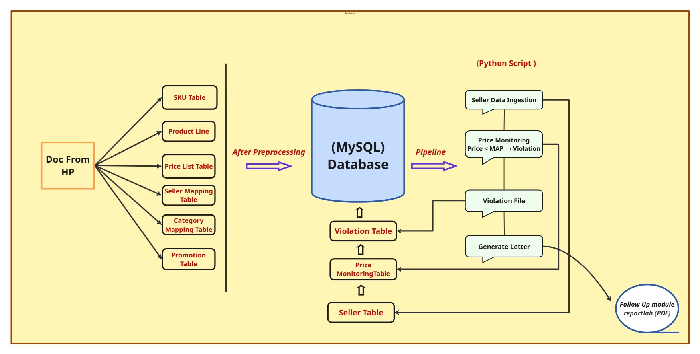

<h1 align="center">MAP Compliance Automation System</h1>

<p align="center"><b>Automated Price Monitoring & Violation Detection Across Multi-Marketplaces</b></p>

<p align="center">
  
  
  
  
</p>

----



---

## 🔹 Overview

An end-to-end automated MAP compliance monitoring system that processes **150K+ product listings** from **901 sellers across 5 marketplaces**, detects pricing violations, resolves seller identities, and triggers enforcement actions — replacing fragmented manual tracking with consistent, near real-time surveillance.

---
## 🔹 Tech Stack

Python • SQL • Pandas • NumPy • MySQL • Apache Airflow • ReportLab 

---

## 🔹 Business Problem

Brands enforce **Minimum Advertised Price (MAP)** policies to protect **brand value** and maintain **pricing consistency** across resellers. However, monitoring compliance across **5 online marketplaces** is challenging due to **frequent price changes**, **seller aliases**, **fragmented data sources**, and the lack of a **centralized audit trail**. These challenges lead to **missed violations**, **inconsistent enforcement**, **price erosion**, and potential **revenue loss**. The objective was to build an **automated MAP compliance system** that could **detect violations**, **identify repeat offenders**, and provide a **unified compliance dashboard** for efficient monitoring and enforcement.

---------------


## 🔹 Business Impact

→ Monitored **1,500+ product listings** and tracked **150K+ pricing records** across **5 marketplaces** through an automated MAP compliance pipeline.

→ Detected and logged **10,000+ MAP violations** using rule-based price validation and automated compliance monitoring.

→ Consolidated **901 seller aliases into 100 unique parent sellers** using fuzzy matching, improving repeat-offender identification and enforcement accuracy.

→ Enabled near real-time monitoring by **replacing manual reviews** with automated compliance scans every **12 minutes**, improving violation visibility, audit readiness, and enforcement responsiveness.

→ Estimated a **30% reduction in manual compliance review effort** by automating monitoring, tracking, and reporting workflows.

---

## 🔹 Key Concepts & Example

| Term          | Definition                                        | Example     |
| ------------- | ------------------------------------------------- | ----------- |
| **MAP**       | Minimum Advertised Price set by the brand         | $100        |
| **LPP**       | Lowest Possible Price derived from MAP            | $95         |
| **SAP**       | Seller Advertised Price listed on the marketplace | $90         |
| **Violation** | Occurs when **SAP < LPP**                         | $90 < $95 ✅ |

### Example Violation

**Seller:** 7-Eleven
**Alias:** Smart Place Store
**SKU:** GT53XL

**System Workflow:**

1. Detects **SAP ($90) < LPP ($95)** → MAP violation flagged.
2. Uses **fuzzy matching** to map **"Smart Place Store"** to **"7-Eleven"**.
3. Records the violation in the compliance database.
4. Generates an automated PDF warning notification.
5. Tracks repeat violations and triggers enforcement actions when thresholds are exceeded.


---

## 🔹 System Architecture

```text
CSV / Excel Files
        ↓
Data Ingestion & Deduplication (Python)
        ↓
Seller Identity Resolution (Fuzzy Matching)
        ↓
MySQL Compliance Database
        ↓
MAP Compliance Engine (SAP < LPP)
        ↓
Violation Detection & Audit Logging
        ↓
Enforcement Engine
        ↓
PDF Warning Notifications
```

### Execution Workflow

* Ingests pricing data from CSV/Excel sources.
* Cleans, deduplicates, and standardizes seller information.
* Resolves seller aliases using fuzzy matching.
* Stores products, sellers, listings, and violations in MySQL.
* Detects MAP violations using the rule **SAP < LPP**.
* Logs violations for compliance tracking and auditing.
* Generates automated PDF warning notifications.
* Scheduled and orchestrated using **Apache Airflow**, running every **12 minutes**.

### Enforcement Logic

| Violation Count     | Action                   |
| ------------------- | ------------------------ |
| First Violation     | PDF warning notification |
| Repeated Violations | Category suspension      |
| All Violations      | Logged to audit trail    |


---


## 🔹 SQL Queries

<details>
<summary><b>Violation recording query</b></summary>
   
```sql
INSERT INTO violation_table (
    sku, seller_name, homologated_sellers,
    region, advertised_price, LLP,
    promotional_price, season,
    violation_flag, violation_date, marketplace
)
SELECT
    sku, seller_name, homologated_sellers,
    region, advertised_price, LLP,
    promotional_price, season,
    violation_flag, violation_date, marketplace
FROM price_monitoring
WHERE violation_flag = 'VIOLATION';
```

</details>

<details>
<summary><b>Repeat offender detection</b></summary>
   
```sql
SELECT
    seller_name,
    sku,
    category,
    COUNT(*) AS violation_count
FROM violation_table
GROUP BY seller_name, sku, category
HAVING COUNT(*) > 3
ORDER BY violation_count DESC;
```

</details>

------

## 🔹 Project Structure

```map-compliance/
│
├── pipeline/
│   ├── ingestion.py           # Data ingestion & deduplication
│   ├── identity_resolution.py # Fuzzy seller alias mapping
│   ├── compliance_engine.py   # SAP vs LPP violation detection
│   └── enforcement.py         # Warning & suspension logic
│
├── sql/
│   ├── violation_insert.sql
│   └── repeat_offenders.sql
│
├── reports/
│   └── warning_template.py    # ReportLab PDF generator
│
├── dags/
│   └── map_dag.py             # Airflow DAG definition
│
├── requirements.txt
├── README.md
└── .gitignore
```

---

## 🔹 Challenges

- **Seller alias explosion** — same reseller operating under 10+ storefronts required fuzzy matching + manual lookup tables to consolidate accurately
- **Idempotency** — pipeline runs every 12 minutes, so duplicate violation inserts had to be prevented via MySQL deduplication logic
- **Scale** — 150K+ listings per run required efficient batch processing to avoid memory issues

---

## 🔹 Future Enhancements

- Real-time marketplace price scraping
- ML-based seller identity resolution
- Automated email notification system
- Seller risk scoring model
- Near real-time monitoring pipeline
